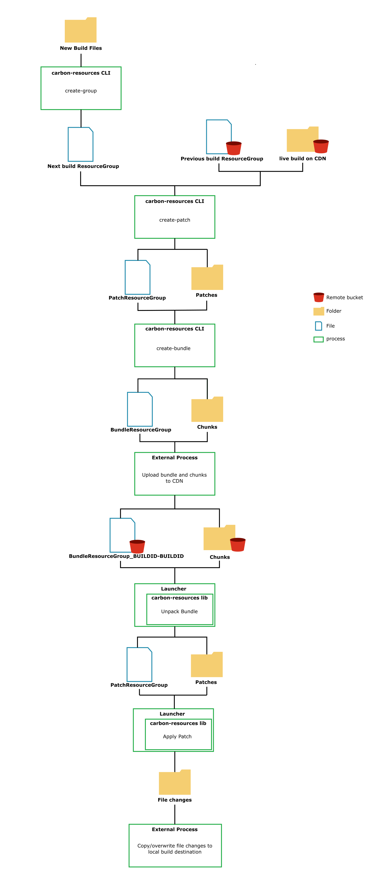

Patching Process Overview
=========================

The patching process is a multi stage process with many inputs and outputs.

This document presents a graphical overview of patch creation and patch application.

For further practical examples refer to :doc:`../QuickStart/ExamplePatchCreationProcedure` and :doc:`../guides`

*Note this is just one example usecase, carbon-resources is able to handle many usage scenarios.*

.. note::
    File uploading to CDN is outside the scope of carbon-resources currently.

Patch Creation
--------------

Patches are created with the following requirements

1. Latest build available on the local machine following a standard filesystem pathing structure ``LOCAL_RELATIVE``
2. Previous build available via a CDN following pathing structure ``REMOTE_CDN``
3. carbon-resources CLI is available on local machine.

Patch Application
-----------------

Patches are applied with the following requirements

1. carbon-resources lib is included inside a launcher style application.
2. System patch application is running on has access to files on CDN.

